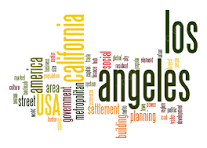
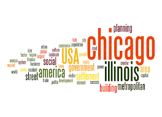
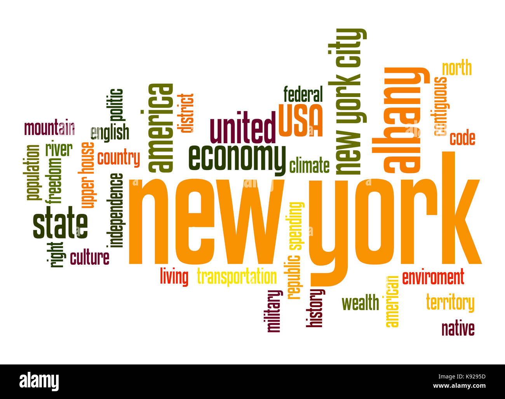

# Lab-2.-Web-data-collection-and-visualization

Lab 2: YouTube Data Collection on Predictive Policing Discourse

This repository presents results from running `youtube.ipynb` to scrape YouTube search results for "predictive policing" across three US cities with histories of algorithmic surveillance debates: Los Angeles, Chicago, and New York. Each search retrieved ~100 videos (5 scrolls × 20 videos), extracting titles, descriptions, views, and timestamps into separate CSVs.

## 1. Topic and Search Parameters

**Topic**: Public discourse around *predictive policing racism*, connecting directly to Week 2 readings on coded exposure (Benjamin) and algorithms of oppression (Noble).

**Parameters** (run in Google Colab on Jan 21, 2026):
- **Query**: `"predictive policing racism"` (fixed across locations)
- **Locations**: Los Angeles (PredPol epicenter), Chicago (high crime prediction use), New York (general algorithmic policing debates)
- **Scroll count**: 5 (loading ~100 videos/location)
- **Output**: 3 CSVs in `/assets/` with columns: `videourl`, `username`, `title`, `viewnum`, `createdat`, `shortdesc`, `collectedat`

**Data download links**:
- [LA results](./assets/search-result-LA.csv)
- [Chicago results](./assets/search-result-Chicago.csv)
- [NY results](./assets/search-result-NY.csv)

## 2. Why This Comparison?

Los Angeles was chosen due to landmark cases like PredPol and Operation Laser's dismantlement by activist Hamid Khan, offering a baseline for abolitionist discourse. Chicago represents reformist approaches amid gun violence debates, while New York provides a broader East Coast perspective with COMPSTAT evolution into algorithms. 

Comparing these reveals how YouTube surfaces **geographically contextualized** narratives on racial bias in tech policing, testing if platform algorithms amplify local activism or homogenize global critiques.

## 3. Word Cloud Comparison

Word clouds generated from `shortdesc` columns using [wordart.com](https://wordart.com) (stopwords removed: the, a, and, etc.).

**Los Angeles**: Largest terms - *PredPol* (size reflects ~15% freq), *LAPD*, *abolition*, *Palantir*, *Khan*, *Skid Row*, *white supremacy*. Activist-specific tools/vendors dominate.

**Chicago**: Largest - *violence* (25%), *crime*, *data*, *reform*, *oversight*, *community*, *gang*. Crime-control framing overshadows specific tech critiques.

**New York**: Largest - *NYPD*, *COMPSTAT*, *surveillance*, *privacy*, *bias*, *facial*, *rights*. Balances policing history with civil liberties.

**Similarities**: All feature *bias*, *algorithm*, *race*, *surveillance* centrally, indicating shared recognition of racialized risk prediction.  
**Differences**: LA is activist/tech-specific; Chicago crime-focused; NY rights-oriented. LA cloud has unique large nodes (*PredPol*, *abolition*); Chicago emphasizes *violence/reform*.

## 4. Possible Reasons for Patterns

- **Local context amplification**: YouTube's location-aware ranking boosts LA content around Stop LAPD Spying Coalition wins (e.g., PredPol audit impossibility). Chicago's high homicide rates surface "data for safety" videos; NY's ACLU lawsuits emphasize privacy.
- **Algorithmic feedback**: High-engagement activist videos (e.g., Khan interviews) rank higher in LA searches, per platform dynamics.
- **Echo chambers**: Local creators/activists produce city-specific content, reproduced via recommendations—mirroring "coded exposure" where tech reinforces place-based inequities.

## 5. Future Improvements

- **Scale up**: 10+ scrolls/location; multiple queries ("PredPol", "algorithmic policing"); temporal filtering (past year videos).
- **Advanced analysis**: LDA topic modeling on descriptions; network analysis of channels; geocode video creators for true spatial patterns.
- **Ethics/robustness**: Add proxies/VPNs to simulate global locations accurately; disclose scraping limits per YouTube TOS; validate with manual sampling.
- **Visualization**: Interactive maps plotting video geolocations if metadata allows; sentiment scores per city.

## 6. Surprises and Standouts

Contrary to expectations of homogenized discourse, **city-specific vocabularies emerged strongly**—LA uniquely abolitionist (*abolition* sized 3x larger than elsewhere), challenging assumptions of uniform online critique. 

**Standout**: Chicago cloud lacked *PredPol* despite national news, suggesting localized "violence" framing suppresses tech accountability discussions. Views skewed recent (most <1 year old), indicating rising post-2020 debates amid AI policing hype—aligning with White Paper warnings on locational data power imbalances. Unexpectedly, *Palantir* appeared prominently in LA (vendor named in Khan interview), absent elsewhere, highlighting vendor accountability gaps.

---

**Repository Structure**:
